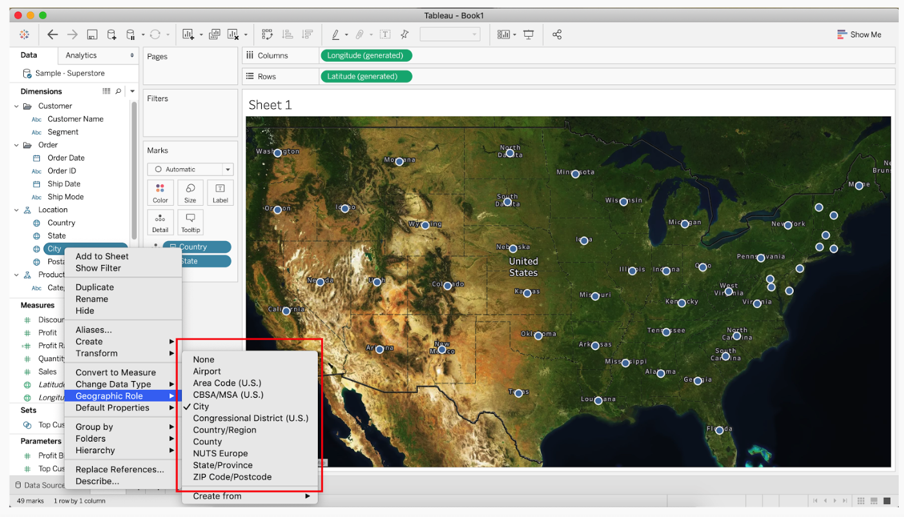
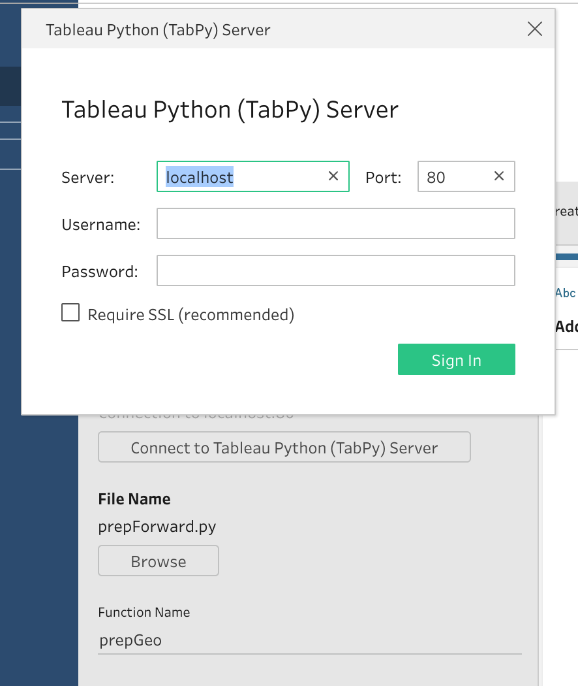

# Tableau Geocoding with Mapbox

This solution allows you to use Tableau Prep for performing forward and reverse geocoding, integrated via [TabPy](https://github.com/tableau/TabPy).

This repository also includes instructions for launching your own TabPy instance, there is a sample script for deploying this on AWS for testing and use at scale.

<!-- toc -->

- [Tableau Geocoding with Mapbox](#tableau-geocoding-with-mapbox)
  - [Geocoding](#geocoding)
  - [Usage](#usage)
    - [Prerequisites](#prerequisites)
    - [Geocoding in Prep](#geocoding-in-prep)
    - [Forward Geocoding Requirements](#forward-geocoding-requirements)
    - [Reverse Geocoding Requirements](#reverse-geocoding-requirements)
  - [Customization](#customization)
    - [Geocoding Customizations](#geocoding-customizations)
    - [Build and Connect](#build-and-connect)
    - [Customization Example](#customization-example)
    - [Rate Limiting](#rate-limiting)
  - [Production](#production)

<!-- tocstop -->

## Geocoding

Tableau Desktop and Prep already geocode for a specific set of geographies (known as Geographic Roles).



There are times users require either more granular data, or additional context about a location-related data point. You can enrich your data through geocoding:

- Forward: Query with text and receive a coordinate pair
- Reverse: Query with a coordinate pair and receive a location.

The Mapbox Geocoding API provides global scale and data coverage. It is also available to all users (no Enterprise Agreement required). For more information, consult the [Mapbox pricing page](https://www.mapbox.com/pricing/#geocode).

## Usage

To simplify setup and deployment, this solution wraps [TabPy](https://github.com/tableau/TabPy) in Docker. This enables cross-platform usage with minimal setup, while also reducing the amount of code a Tableau Desktop user must write.

The architecture is displayed below


### Prerequisites

You need to have Docker installed on your platform: [Mac](https://docs.docker.com/docker-for-mac/install/) / [Windows](https://docs.docker.com/docker-for-windows/)

### Geocoding in Prep

To get started run the following command

```bash
docker run -d -p 80:80 mbxsolutions/tableaugeocode
```

This will bring down the [fully built image from Docker Hub](https://hub.docker.com/r/mbxsolutions/tableaugeocode) and start it running on port 80.

The next step is to configure your geocoding script with your Mapbox token.

There are a sample scripts for forward and reverse geocoding found in this repository. You can access after cloning, or simply copy and paste from the snippet below.

`prepForward.py` is for forward geocoding while `prepReverse.py` is for reverse geocoding. Before you begin, if you would like more details about the response object read the [Geocoding API documentation](https://docs.mapbox.com/api/search/#geocoding-response-object).

Paste your Mapbox token to replace "token" and save.

```python
# This allows your script to access to published function
import sys
sys.path.append('/TabPy')
from geocode import geocodeForward

# This is the function you reference in Tableau Prep
def prepGeo(input):
    # YOUR TOKEN GOES HERE
    prepData = geocodeForward(input,"token")
    return prepData

# This is the output schema that is passed to Tableau Prep when geocoding is complete
def get_output_schema():
    return pd.DataFrame(
        {
            "InitialQuery": prep_string(),
            "ReturnAddress": prep_string(),
            "Accuracy": prep_string(),
            "Relevance": prep_decimal(),
            "Longitude": prep_decimal(),
            "Latitude": prep_decimal(),
        }
    )
```

After configuring your Python script, it is time to connect Tableau Prep.

- Server: localhost
- Port: 80
- File Name: prepForward.py (if that is what you called it)
- Function Name: prepGeo

This configuation configuration should look like this:



Once input, your geocoding process will complete and return new data to your flow.

### Forward Geocoding Requirements

Your data must contain a column titled `Address`. For the most accurate geocode, you should include as much geographic information (City, State, ZIP) in your Address.

### Reverse Geocoding Requirements

Your data contain two columns, `Longitude` and `Latitude`. These columns can be of type float or string.

## Customization

If you wish to alter the scripts or Docker image in any way, you can use the files found in `src`.

### Geocoding Customizations

The forward and reverse scripts default to a global search and a limit of one. This means that the geocoder will find the *optimal single result* for your query.

If you would like to refine your results, the Mapbox Geocoding API supports the following set of options. Edits to the default geocoding can be made at `src/geocode.py`. After edits, you must [rebuild the image](#build-and-connect) to validate.

| Type                | Filter            | Description                                                            |
|---------------------|-------------------|------------------------------------------------------------------------|
| Forward and Reverse | Country Filtering | Specify country or list of countries to restrict results               |
| Forward and Reverse | Limit             | Upper bound on number of results (max 10, default 1)                   |
| Reverse             | Type              | Specify the type of result to return (country, postcode, address, etc) |
| Forward             | Bbox              | Include only results that are within a given bounding box              |
| Forward             | Proximity         | Bias results that are closer to a given location                       |

For more details on these options, consult the [Geocoding API documentation](https://docs.mapbox.com/api/search/).

### Build and Connect

Once you have made your updates, run the following commands from within `src`.

```bash
docker build --tag tabpy .
docker run -d -p 80:80 tabpy
```

- docker build --tag tabpy: Build and tag your image as `tabpy` for running
- docker run -d -p 80:80 tabpy: Run the imaged `tabpy` in detached (`d`) mode, mapping the container port 80 to localhost 80 (`p 80:80`).

This will build and run the TabPy instance on your machine. To confirm that the image is running, either run `curl localhost/info` from your terminal or:

```bash
docker ps
```


Once you have confirmed that your image is running, open Tableau Prep 2019.3 (and above) and add a [Script node](https://help.tableau.com/current/prep/en-us/prep_scripts_TabPy.htm#add-a-script-to-your-flow).

This will connect Prep to TabPy as indicated above.

### Customization Example

For reverse geocoding, if you wish to filter to specific countries, you will either need to include a column in your data called "countries" (or similar) or hard code it into your script. All edits would need to be made to the [core geocoding script](src/geocode.py).

**Column-based approach**

```python
def geocodeReverse(input,token):
    url = "https://api.mapbox.com/geocoding/v5/mapbox.places-permanent/%s.json?access_token=%s&types=address&country=%s&limit=1"
    access_token = token
    input['coords'] = input['longitude'].map(str)+","+input['latitude'].map(str)
    coordinates = list(input["coords"])
    countries = list(input["countries"])
    urls = [url % (quote(list_item), access_token,countries) for list_item in coordinates]
```

**Hard code approach**

```python
def geocodeReverse(input,token):
    url = "https://api.mapbox.com/geocoding/v5/mapbox.places-permanent/%s.json?access_token=%s&types=address&country=%s&limit=1"
    access_token = token
    input['coords'] = input['longitude'].map(str)+","+input['latitude'].map(str)
    coordinates = list(input["coords"])
    countries = 'us'
    urls = [url % (quote(list_item), access_token,countries) for list_item in coordinates]
```

### Rate Limiting

The default rate limit for Geocoding API requsts is 600/minute. The included [Python scripts](src/geocode.py) enforce this limit with the [ratelimit](https://github.com/tomasbasham/ratelimit) package. If you exceed your rate limit, your results will fail. If you would like to know more about rate limiting, read the [Mapbox API documentation](https://docs.mapbox.com/api/#rate-limits).

```python
# This is the rate limit period in seconds
# Mapbox rate limits on a per-minute basis, with geocoding set at 600 requests per minute
RATE_LIMIT = 600
LIMIT_DURATION = 60

# Set up rate limiting for API calls
# If rate limit is exceeded, sleep the thread and wait until the LIMIT_DURATION has lapsed
# If you request an increased rate limit, update RATE_LIMIT above
@sleep_and_retry
@limits(calls=RATE_LIMIT, period=LIMIT_DURATION)
def req(url):
    try:
        with urlopen(url, context=ctx) as conn:
            return conn.read()
    except error.HTTPError as e:
        print(url)
```

`RATE_LIMIT` is the number of requests. `LIMIT_DURATION` is the amount of time that `RATE_LIMIT` is measured against.

Our estimate is that a single thread will approach `1200` records per minute, meaning that any `RATE_LIMIT` above that value will be redundant as the script cannot process that much data. You can achieve better performance with threading. This is achieved in the following line of code:

```python
with ThreadPoolExecutor(max_workers=1) as executor:
```

The parameter `max_workers=1` is how to control scale.  So if you have a `RATE_LIMIT` of `2400`, you can set `max_workers` to 2 split the work across two parallel threads leading to roughly half the time to completion. Parallelism will scale linearly, but there are diminishing returns as thread values increase.

## Production

If you will need geocoding at a scale beyond a single machine - you can deploy this solution into production. We provide you with a script to do this in `src/deploy`.

```bash
cd src/deploy
npm ci
pulumi up -y
```

We use [Pulumi](https://www.pulumi.com/docs/index.html) to deploy our version of TabPy into AWS and wrap it behind a load balancer. This will give you a stable URL for sharing in your organization, and the ability to scale it up and down based on load.

When deploying, Pulumi will build from the Dockerfile included in this repository, not the published one.

**WARNING**: Mapbox rate limits are applied at the token level, so if you have a rate limit of 600 and deploy 4 instances of TabPy, you could quickly go over your limit without knowing.
